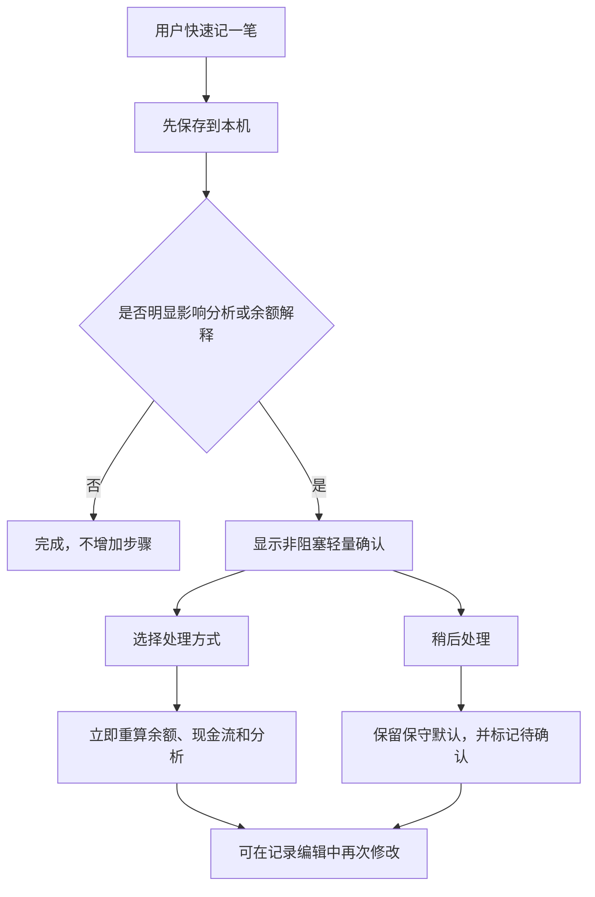
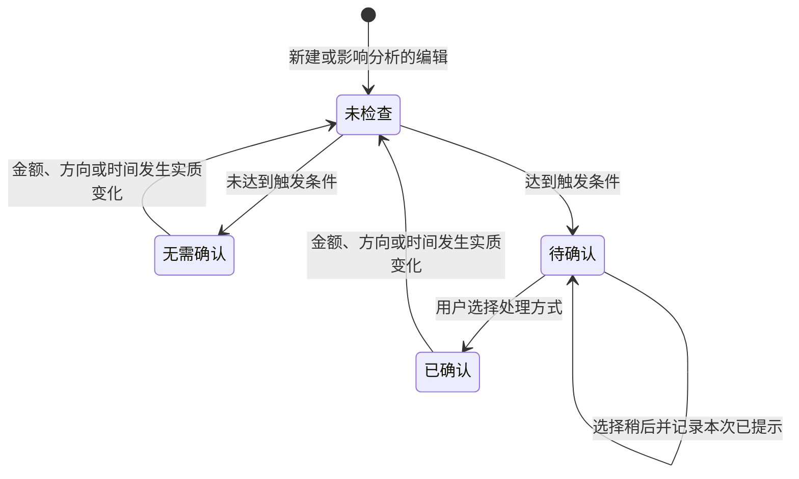

# “记一笔”支出分析与异常交易处理产品规范

- 文档状态：已批准并实现
- 初稿日期：2026-08-11
- 本次修订：2026-08-19
- 适用范围：记账、首页资金状态、分析页、备份与云同步
- 本文边界：记录已实现的产品语义、计算口径、交互规则和验收标准；明确列出的非目标仍未实现

## 1. 执行摘要

“记一笔”的余额代表用户全部个人可用资金，而不是单张银行卡或单个账户。基于这一边界，产品需要同时维护三种互不替代的口径：

1. **账面余额**：回答“现在实际有多少钱”。
2. **现金流**：回答“这段时间钱从哪里来、到哪里去”。
3. **日常花法**：回答“如果接下来继续按近期已记录的日常支出方式消费，余额可能怎样变化”。

“已存金额”是账面余额中的用途标记，不是第四种现金流。它回答“这些钱是否仍打算花掉”，并用于从总余额中得到可花余额。单一存钱目标只是截止日期与目标总额，不会提前占用可花余额。

当前只统计负金额来推导消费速度，这个方向本身正确。风险不在于排除了收入，而在于所有负金额都被默认视为可代表未来的日常支出，同时账目没有表达退款、报销、一次性支出和账户转账等语义。

本规范确认采用以下方向：

- 不按日期或金额自动抵消收入与支出。
- 全部真实外部收支继续影响账面余额。
- 用户自己账户之间的转账不改变全部个人可用资金。
- 一次性支出影响实际余额和实际现金流，但不用于推算未来的日常花法。
- 已到账的一次性收入影响实际余额，但不会自动成为后续周期的收入预期。
- 退款或报销只有在用户确认关联后，才调整对应支出的分析口径。
- 快速记账仍然先保存；仅在交易明显影响分析时，保存后进行一次非阻塞的轻量确认。
- 固定账单预测继续不在当前范围内，因此结论必须明确限定为“按近期已记录花法估算”。

### 实施状态

Layer 1、Layer 2 与独立存钱目标均已批准并实现：现金流与日常花法已分离；处理方式、确认状态、恢复分摊和存钱事件写入 IndexedDB，进入加密备份 payload v5，并通过同步协议 v7 与 D1 持久化。每期建议与其他分析结果仍只在客户端派生，不写入备份或云端。服务端仅在账本仍可无损表示时兼容 v1–v6；存在旧协议无法表达的新目标语义时返回 `upgrade_required`。

## 2. 背景与证据

### 2.1 已确认的产品决定

| 决定 | 状态 | 来源 |
|---|---|---|
| 余额代表全部个人可用资金 | 已确认 | 2026-08-11 用户决定 |
| 接受异常交易保存后的轻量确认 | 已确认 | 2026-08-11 用户决定 |
| 保持极速记账，不给每笔交易增加强制分类 | 已确认方向 | 项目产品原则与本次讨论 |
| 不自动复制或推断未来收入 | 已确认方向 | 单一预计收入设计 |
| 当前版本不预测固定支出 | 已确认约束 | `AGENTS.md` 与 `README.md` |

### 2.2 当前实现事实

- 账面余额、实际现金流和日常花法按处理方式分别计算；账户转账对全部个人可用资金中性。
- 普通支出进入日常花法；一次性与可报销支出不外推；恢复分摊按用户确认金额调整原始支出。
- 收入不会启动支出观察窗口，最近最多 30 个已完成自然日按线性比例外推，14 天以下不输出预测结论。
- 异常账目先持久化再提示；同一修订不重复主动弹出，待确认入口可恢复。
- 分析结果本身只在本机派生；处理方式、确认元数据、恢复分摊和存钱事件进入备份 payload v5 与同步协议 v7。

### 2.3 已识别的问题

1. **金额符号不足以表示交易语义。** 正数可能是收入、退款、报销、借入资金或账户转入；负数可能是日常消费、一次性支出、可报销垫付或账户转出。
2. **按天净额会丢失信息。** 同一天 `+¥8,000` 与 `-¥8,000` 可能互不相关，也可能是一组报销交易，不能仅凭日期判断。
3. **所有支出线性外推会放大异常值。** 一次旅行、医疗或设备购买可能持续影响 30 天预测。
4. **统计天数不等于记录完整度。** 30 天跨度只能证明时间跨度，不能证明每天都记完整。
5. **轻量化与完整现金流预测存在边界。** 不记录未来固定账单，就不能保证房租等已知支出发生后仍然够用。

## 3. 产品目标与非目标

### 3.1 产品目标

- 保持几秒内完成一笔记录，不让分析配置阻塞本机保存。
- 保证余额始终可解释，并与全部个人可用资金的边界一致。
- 分开呈现收入、支出和净现金流，不用净额掩盖大额流入或流出。
- 只让具有未来代表性的支出进入“日常花法”预测。
- 让用户能看见并纠正系统对异常交易的默认处理。
- 让相同账本在离线、本机备份和多端同步后得到一致分析结果。
- 对无法判断的记录完整度、异常交易和未来固定支出保持诚实。

### 3.2 明确不做

- 不增加强制消费分类或分类预算。
- 不使用机器学习自动判定交易用途。
- 不根据同日、同金额或备注自动合并交易。
- 不根据历史收入自动推断下一次收入。
- 不增加完整的多账户、资产、负债或贷款管理。
- 不把未来日期账目用作定时账单或计划交易。
- 不预测尚未由用户输入的固定账单。
- 不把预测描述为保证，也不生成伪精确的可靠度百分比。

## 4. 概念模型与术语

### 4.1 核心对象

| 对象 | 用户定义 | 主要属性 | 关系与行为 |
|---|---|---|---|
| 账目 | 一次真实发生或需要保留记录的资金事件 | 金额、时间、文字、截图、处理方式 | 影响余额、现金流或日常花法中的一种或多种口径 |
| 处理方式 | 这笔账在分析中代表什么 | 普通收支、一次性支出、可报销支出、退款/报销、账户转账 | 属于账目的分析属性，不是消费分类 |
| 恢复分摊 | 把一笔退款或报销的全部或部分金额分配给原始支出 | 恢复流入账目 ID、原始支出账目 ID、分摊金额 | 必须由用户确认，不自动建立；多条分摊共同表达部分、多次或多笔恢复 |
| 收入预期 | 下一次预计到账日的一次性预计收入 | 本次预计到账日、预计金额 | 只用于随后周期比较，不提前进入余额；本次日期可延期且不改变长期默认发薪日 |
| 存钱目标 | 用户希望在某个日期前累计存到的金额 | 截止日期、目标总额 | 不代表真实银行账户，不改变总余额，也不随发薪周期重置 |
| 存钱事件 | 对已存用途的事实变更 | 已有存款、存入、取用；旧版周期结算只读兼容 | 独立于收支；直接用于支出时可与对应支出账目关联 |
| 支出基线 | 近期可代表未来的日常支出集合 | 统计窗口、纳入金额、排除金额 | 从账目派生，不单独持久化 |

### 4.2 处理方式的业务语义

| 处理方式 | 影响全部个人可用余额 | 进入现金流 | 进入日常花法 | 说明 |
|---|---:|---:|---:|---|
| 普通支出 | 是，减少 | 是，计为流出 | 是 | 默认的负金额处理方式 |
| 一次性支出 | 是，减少 | 是，计为流出 | 否 | 已经发生，但不假设未来重复 |
| 可报销支出 | 是，减少 | 是，计为流出 | 否 | 报销到账前仍降低当前余额 |
| 普通收入 | 是，增加 | 是，计为流入 | 不适用 | 不自动沿用到未来周期 |
| 退款/报销 | 是，增加 | 是，单独标明恢复流入 | 不适用 | 有效分摊按金额抵减原始普通支出的日常花法金额 |
| 账户转账 | 否 | 否 | 否 | 用户明确确认资金只在自己的账户之间转移；产品不凭日期、金额或备注自动判定 |

如果退款或报销无法关联到原始账目，它仍作为恢复流入影响余额和现金流，但不得自动修改任意历史支出的分析口径。一笔恢复流入可以分摊给多笔支出，一笔支出也可以接受多次恢复；每笔分摊必须为正，累计不得超过恢复流入金额或原始支出尚未恢复的金额。部分退款只抵减对应金额，不能把整笔原始支出全部排除。

### 4.3 统一用语

| 使用术语 | 避免使用 | 原因 |
|---|---|---|
| 账面余额 / 当前余额 | 净资产 | 当前产品不管理资产和负债 |
| 现金流净额 | 今天赚了/亏了 | 净额不能替代收入和支出明细 |
| 日常花法 | 花费速度、真实生活成本 | 只代表经过筛选的近期账目 |
| 数据覆盖 N 天 | 可靠度 N 天、完整记录 N 天 | 时间跨度不证明记录完整 |
| 一次性支出 | 异常消费 | 避免带有价值判断 |
| 按近期已记录花法估算 | 一定够用、保证够用 | 明确模型边界 |
| 总余额 / 已存金额 / 可花余额 | 周期底线、存款账户 | 分开表达真实资金、用途标记和当前可支配金额 |
| 存钱目标 | 每周期必须存下 | 目标是某个截止日前的累计总额，不随周期重置 |

## 5. 计算规范

### 5.1 当前余额

```text
当前余额 = 初始余额 + 全部外部实际流入 - 全部外部实际流出
```

- 软删除账目不参与余额。
- 普通收支、一次性支出、可报销支出以及退款/报销都参与余额。
- 经用户明确确认的账户转账不参与余额，因为资金未离开或进入全部个人可用资金边界；未经确认的交易仍按普通收入或支出处理。
- 收入预期不参与余额，只有确认到账后生成的实际收入才参与。
- 存入和取用不参与余额；它们只改变总余额中“已存金额”的用途标记。历史周期结算继续作为旧版存入兼容读取。

### 5.2 现金流

同一时间范围内必须同时提供：

```text
实际流入 = 普通收入 + 退款/报销等外部流入
实际流出 = 普通支出 + 一次性支出 + 可报销支出
现金流净额 = 实际流入 - 实际流出
```

- 经用户明确确认的账户转账不进入三个值；转账候选在确认前先按普通外部流入或流出处理，并保持待确认提示。
- 收入和支出必须分别可见，不能只展示净额。
- 退款/报销可在明细中单独标明，但仍属于实际流入。
- 部分退款或报销按实际关联金额计入恢复流入，原始支出的其余金额继续保留原有处理方式。
- 现金流用于解释过去，不直接替代支出预测。

### 5.3 日常花法基线

只有同时满足以下条件的账目才进入预测基线：

- 有效且未软删除。
- 发生时间不在未来。
- 金额为负。
- 处理方式为普通支出，或尚未确认但按保守默认暂时计入普通支出。
- 不是账户转账、一次性支出或可报销支出。

```text
普通支出净分析金额 = 普通支出绝对值 - 分摊给该支出的有效退款/报销金额
日常支出总额 = 统计窗口内普通支出净分析金额之和
日常支出日均 = 日常支出总额 ÷ 数据覆盖自然日数
```

- 普通支出净分析金额最低为 0。
- 恢复金额归属原始支出的发生日期，不归属退款或报销到账日期；这样不会因为到账时间跨月而改写消费发生时间。
- 一次性支出和可报销支出本来就不进入日常花法，恢复分摊只用于解释其资金恢复，不会产生负支出。

金额继续使用整数分，比例计算继续使用 `BigInt` 中间值和既有四舍五入规则。

### 5.4 当前周期预测

```text
保守估算天数 = max(距预计到账日自然日数, 1)
预计剩余日常支出 = 日常支出总额 × 保守估算天数 ÷ 数据覆盖天数
预计周期末总余额 = 当前总余额 - 预计剩余日常支出
可花余额 = 当前总余额 - 当前已存金额
到下次到账差额 = 可花余额 - 预计剩余日常支出
```

- 每月发薪日是长期默认值；本次预计到账日可在对应周期内向后调整。延期时当前周期结束日和图表终点随之延后，下个周期从本次目标日开始，到下一常规发薪日前一天结束。
- 预计到账日当天界面显示“今天”而不是“0 天”，计算仍按一个完整消费日保守估算，避免除零和低估。
- 已经发生的一次性支出仍通过当前余额影响结果，但不会被再次外推。
- 已经发生的一次性收入仍通过当前余额改善结果，但不会被假设再次到账。
- 尚未到账的收入预期不进入当前周期余额。
- 存钱目标不参与“到下次到账”判断；只有实际存入形成的已存金额才减少可花余额。同步冲突造成已存金额为负时不静默截断，而是进入待校正状态。
- 当前版本没有未来固定账单对象，因此必须显示“按近期已记录花法估算”。

### 5.5 下次收入

```text
参考支出 = 日常支出总额 × 下周期天数 ÷ 数据覆盖天数
预计收入差额 = 预计收入 - 参考支出
```

- 该判断回答单一预计收入能否覆盖随后周期的当前日常花法，不回答收入发生概率。
- 历史一次性收入和普通收入都不会自动成为未来收入预期。
- 界面展示预计收入、参考支出和差额，不把当前余额或存钱目标重复扣入该判断。

### 5.6 存钱目标与事件

- 已有存款、存入和取用金额必须为正；历史 `cycle_settlement` 只读兼容并继续计入已存金额，新版本不得创建。
- `剩余目标 = max(目标总额 - 已存金额, 0)`；完成后取用可使目标重新回到进行中或已到期状态。
- 从今天起（含今天）枚举目标截止日前的长期发薪日，`每期建议 = ceil(剩余目标 / 剩余发薪次数)`；无可用发薪日、目标完成或目标过期时不显示。
- 每期建议只在分析页派生展示，不保存、不自动存入，也不影响两项够不够花判断。
- 确认实际收入时只创建实际收入账目并清除本次预期；上次预计金额保留为下次表单默认值，但必须由用户再次确认。
- 直接用存款支付时，同时创建真实支出和关联取用事件；支出编辑、软删除、8 秒撤销与最终清理必须联动。
- 存钱事件不混入最近账目。分析页展示累计目标进度与可展开明细，不再展示周期留存图。

### 5.7 数据覆盖与分析状态

- 收入、退款和账户转账不得启动支出统计窗口。
- 第一笔可用于分析的支出发生后，后续已完成自然日中的无支出日按 0 计入。
- 少于 14 个已完成自然日：不输出够用或短缺结论。
- 14–29 个已完成自然日：显示“初步估算”。
- 30 个已完成自然日：显示“按近 30 天估算”。
- 上述状态只表示数据覆盖时间，不表示记账完整或预测可靠。
- 存在未确认且会明显影响结果的大额交易时，显示“有一笔交易待确认，估算可能变化”。

### 5.8 未来时间账目

- 产品中的账目代表已经发生的资金事件，新建和编辑时不允许选择晚于当前设备时间的发生时间；可容忍必要的短时钟偏差，但不能允许以未来账目代替计划交易。
- 旧数据、导入备份或同步数据中如果存在未来账目，在发生时间到达前不得进入余额、现金流、月度实际值、图表或日常花法。
- 同一天但发生时刻仍在未来的账目也按未来账目处理，不能只比较本地日期。
- 未来账目继续可见并标明“尚未发生”，用户可以修改或删除；到达发生时间后按正常账目自动参与计算。

## 6. 异常交易轻量确认

### 6.1 触发原则

- 账目必须先成功保存到 IndexedDB，再判断是否需要确认。
- 判断和确认均在本机完成，不依赖网络，也不能阻塞云同步队列。
- 只在交易会明显改变余额解释、支出基线或预测结论时触发。
- 不使用单一固定金额作为唯一阈值，应结合近期支出规模和结论是否翻转。
- 首版校准阈值为：支出金额至少达到最近窗口总额的 25%、日均的 5 倍和 ¥500 三者中的最大值；任一阈值取等号即触发。即使未达到大额阈值，若排除该支出会把当前周期从“有缺口”翻转为不再有缺口，也触发确认。
- 正金额与此前 60 天内某笔支出的绝对金额相差不超过 ¥1 时，提示可能为退款/报销；只建议处理方式，不自动建立恢复分摊。

建议的高信号触发条件：

1. 纳入或排除该支出会使“够用/有缺口”结论发生变化。
2. 单笔支出占最近统计窗口日常支出的显著比例。
3. 正金额与近期某笔支出金额接近，可能是退款或报销。
4. 备注或用户操作表明可能是账户转账，但系统不得仅凭文本自动决定。

### 6.2 交互流程



### 6.3 支出确认内容

- 标题：`这笔支出会明显影响估算`
- 说明：`账目已经保存。请选择它是否代表平时的花法。`
- 选项：
  - `日常支出`：计入支出基线，默认选项。
  - `仅这一次`：影响余额和现金流，不用于推算未来。
  - `之后会报销`：影响当前余额，不用于日常花法；允许后续关联报销。
  - `自己的账户间转账`：用户确认后不改变全部个人可用资金，也不进入现金流或日常花法。
- 次要动作：`稍后处理`。

### 6.4 收入确认内容

- 仅在金额明显、可能匹配退款/报销或可能属于转账时出现。
- 标题：`确认这笔资金的来源`
- 说明：`账目已经保存。这个选择只影响余额解释和统计口径。`
- 选项：
  - `收入`：增加余额和实际流入，不自动用于未来收入预期。
  - `退款或报销`：增加余额，并进入关联原始支出的流程。
  - `自己的账户间转账`：用户确认后不改变全部个人可用资金，也不进入现金流或日常花法。
- 不要求区分工资、兼职、奖金或赠款；未来收入仍由“下次收入预期”单独填写。

### 6.5 中断、失败和恢复

- 用户关闭确认层或选择稍后时，已保存账目不得丢失。
- 未确认支出按“日常支出”保守计入，直到用户修改。
- 未确认收入按“收入”处理，但不得自动写入未来收入预期。
- 处理方式保存失败时保留确认层选择，并提供重试；原账目保持已保存状态。
- 同一账目只主动提示一次；编辑金额后再次跨过触发条件时可以重新提示。
- 所有选项必须可通过键盘、触摸和屏幕阅读器操作，焦点关闭后返回原触发位置。

确认状态按以下状态机管理：



- 状态至少需要区分“无需确认、待确认、已确认”，并记录使用的检测规则版本和本次账目修订是否已经提示。
- “稍后处理”保持待确认状态，但同一账目修订版本不再次主动弹出；用户仍可从分析页提醒或记录编辑进入。
- 旧账目迁移为“无需确认”，避免升级后集中弹出历史交易；用户仍可手动修改处理方式。
- 修改金额符号、金额、发生时间或恢复关系后重新进入未检查状态；仅修改文字或截图不重复提示。

## 7. 场景取舍

| 场景 | 余额处理 | 分析处理 | 产品结论 |
|---|---|---|---|
| 稳定日常开支 | 正常增减 | 纳入日常花法 | 当前算法最有意义的场景 |
| 浮动收入 | 实际到账后增加 | 不降低支出日均；未来只使用用户填写的单一预计收入 | 适合做比较，不是收入预测 |
| 刚开始记账 | 正常计算 | 14 天以下不下预测结论 | 诚实但首周价值有限 |
| 经常漏记 | 账面余额也可能不准 | 30 天跨度无法证明完整 | 当前最严重且无法由算法单独修复的风险 |
| 偶发大额支出 | 减少余额 | 用户确认后排除未来外推 | 避免把一次事件复制到整个周期 |
| 同日大额收入与支出 | 分别进入外部流入和流出 | 不按日期自动相抵 | 保留真实现金流与交易语义 |
| 退款或报销 | 原支出先减少余额，到账后恢复 | 按有效分摊金额抵减原始普通支出的日常花法金额 | 需要用户确认关系，支持部分与多次恢复 |
| 自有账户之间转账 | 用户确认后不改变全部个人可用资金 | 不进入收入、支出或预测 | 不自动识别；确认本身就是余额边界声明 |
| 固定账单即将发生 | 尚未发生时不影响余额 | 当前模型不知道其发生时间 | 只能给出带口径限定的趋势预警 |

## 8. 信息呈现要求

### 8.1 首页

- 当前余额继续是最重要的确定性数字。
- 到发薪日结论必须使用“按近期已记录花法估算”。
- 存在待确认交易时，在结论附近显示一条紧凑提醒，不新增长期占位的大卡片。
- 快速记账入口不得因为提醒下移出标准手机首屏。
- 不在首页同时展开收入、支出、净额和多种排除场景。

### 8.2 分析页

- “实际现金流”同时展示收入、支出和净额，三者均为已发生事实。
- “日常花法”展示纳入金额、排除金额、数据覆盖天数和待确认数量。
- 本周期实际支出包含已发生的外部流出；预测部分只使用日常花法基线。
- 图表中的一次性支出必须可识别，不能让用户误以为它已从账本删除。
- 不生成“包含异常支出 × 排除异常支出 × 多档收入”的场景矩阵。
- 数据表与屏幕阅读器说明必须使用与可见界面一致的口径。

关键指标与图表使用以下固定口径：

| 指标或序列 | 使用金额 | 退款/报销处理 | 一次性与可报销支出 |
|---|---|---|---|
| 当前余额 | 截至当前时刻的全部外部净流入 | 到账时增加余额 | 已发生时减少余额 |
| 本月收入 | 普通外部收入 | 不计入收入，单列为恢复流入 | 不适用 |
| 本月支出 | 全部外部实际流出总额 | 不回写或冲减历史实际流出 | 计入并保持可见 |
| 本月现金流净额 | 全部外部流入减全部外部流出 | 计入外部流入 | 计入外部流出 |
| 日常支出日均 | 普通支出净分析金额 | 按分摊金额归回原支出日期抵减 | 不计入 |
| 当前周期累计支出 | 全部外部实际流出累计 | 不冲减实际累计线 | 计入，并以文字或纹理标明非日常部分 |
| 当前周期预测支出 | 截至今天的实际外部流出加未来日常花法预测 | 只通过日常支出基线影响未来段 | 已发生部分保留，未来不重复外推 |
| 完整到账周期支出 | 各周期全部外部实际流出 | 不冲减历史实际流出 | 计入，并在数据表列出非日常金额 |
| 每日支出 | 按发生日聚合的全部外部实际流出 | 不移动到恢复到账日 | 计入，并在数据表标明处理方式 |

账户转账和尚未到达发生时刻的未来账目不进入上述任何金额序列。恢复分摊只改变日常花法基线，不改写已经发生的毛流入或毛流出历史。

### 8.3 账目记录

- 记录行可显示简短处理方式，例如“一次性”“报销”或“账户转账”，但普通收支不增加标签噪声。
- 编辑记录时可以随时修改处理方式。
- 修改处理方式后立即重算余额、现金流和分析；账户转账状态变化也必须重算余额。
- 删除有关恢复分摊的账目时必须明确对应关系如何处理，不得留下不可解释的隐藏调整。

## 9. 数据、备份与同步影响

分析结果仍然只在客户端派生，但“处理方式”和“关联账目”属于账目事实，必须持久化。否则同一账本在不同设备上会产生不同余额和预测。

### 9.1 本机数据

- `LedgerEntry` 需要新增可迁移的处理方式、确认状态、检测规则版本和已提示修订信息。
- 恢复分摊应使用单一权威关系对象，保存恢复流入账目 ID、原始支出账目 ID 和分摊金额；不得在两条账目上分别维护可能不一致的双向副本。
- IndexedDB 需要升级版本；旧负金额默认迁移为普通支出，旧正金额默认迁移为收入。
- 不得根据旧金额、日期或备注自动迁移为转账、退款或一次性交易。
- 处理方式更新、关联关系更新及其 outbox 记录必须在同一事务中完成。
- 恢复分摊必须校验：两端账目存在且有效、恢复端为正金额退款/报销、支出端为负金额、不能自关联、分摊金额为正且累计不超额。
- 存钱事件使用独立表；与支出关联的取用事件必须和支出编辑、删除、撤销及 outbox 在同一事务中处理。

恢复分摊的生命周期规则：

- 任一关联账目进入 8 秒软删除期时，相关分摊立即停止参与计算，但关系保留以支持撤销。
- 撤销删除时，只有关系仍满足金额与类型校验才重新生效；否则进入待修复状态，不能静默截断金额。
- 软删除超过撤销期并完成附件/账目回收时，相关恢复分摊一并删除。
- 修改金额或处理方式导致现有分摊无效时，保存前必须要求解除或重新分配，不能产生负的未恢复金额。
- 备份恢复和同步冲突选择后必须重新执行完整性校验；失败时保持原账本不变或保留可恢复冲突，不允许部分应用。

### 9.2 加密备份

- 加密信封可以保持不变，内部备份 payload 需要升级版本。
- 旧备份恢复后采用与 IndexedDB 相同的保守默认。
- 新备份恢复后必须保留处理方式、确认状态、恢复分摊、存钱目标与存钱事件。
- 恢复预检必须验证分摊引用、存钱关联、方向、处理方式、累计金额和历史结算唯一性；任一失败不得修改现有数据。
- 预览应显示账目数，不需要暴露分析派生结果。

### 9.3 云同步

- 同步协议 v7 表达账目处理方式、确认元数据、恢复分摊、独立存钱目标、单一预计收入和存钱事件，并继续接收可无损表示的 v1–v6 账本；实际收入确认使用不进入账本或备份的服务端幂等凭据，与正金额账目在同一 D1 批次中提交，0 元确认也能跨设备收敛。旧客户端缺少新字段时不得静默清除云端已有语义。
- 一旦账号中存在账户转账、一次性支出、可报销支出、退款/报销、待确认状态、恢复分摊、存钱目标或有效存钱事件，无法表达相应语义的旧客户端不得继续执行云端拉取、推送或给出“同步完成”。服务端应返回明确的 `upgrade_required`，旧客户端保留本机数据并提示更新应用。
- 旧客户端离线期间产生的 outbox 必须在升级后由新客户端迁移再发送，不能由旧协议覆盖新语义；升级失败时本机账目不得丢失。
- 只有全部账目仍为默认普通收支、不存在恢复分摊且没有 v6 旧版留存语义时，服务端才可以向相应旧协议投影现有账本。
- 新客户端读取旧账目时使用保守默认，不伪造退款或转账关系。
- 关联的两笔账目及关联金额需要作为可冲突、可恢复的关系处理；不能依赖客户端时间戳静默覆盖。
- D1 需要保存处理方式、确认状态、恢复分摊、存钱目标和存钱事件，并校验同一用户代次、关联金额与历史结算唯一性。
- 用户未开启同步时，这些字段只保存在本机；开启同步前应继续沿用现有上传范围说明。

## 10. 验收标准

### 10.1 领域计算

- 同一天无关联的收入和支出分别统计，不自动抵消。
- 一次性支出减少当前余额和增加实际流出，但不增加日常支出基线。
- 可报销支出在报销到账前仍减少当前余额。
- 全额报销到账后增加当前余额；关联成功后原支出不进入日常花法。
- 部分退款或报销只抵减关联金额，原始支出的剩余金额继续按原处理方式参与或排除分析。
- 经用户明确确认的账户转账不改变全部个人可用余额；未经确认的交易仍按普通收入或支出处理。
- 一次性实际收入增加当前余额，但不改变支出日均或后续收入预期。
- 只有收入记录时不得形成支出预测的 14/30 天数据覆盖状态。
- 未来、软删除和账户转账记录不进入支出基线。
- 未来账目在发生时刻到达前不进入余额、现金流、月度实际值或任何图表；发生时刻到达后只计入一次。
- 一笔恢复流入可以部分分摊给多笔支出，一笔支出也可以接受多次恢复；各端累计分摊均不得超额。

### 10.2 交互

- 普通小额记录保持现有最短保存流程，不出现额外确认。
- 异常确认只能在本机保存成功后出现。
- 关闭确认层不丢失账目，待确认状态可在分析页和记录编辑中恢复。
- 修改处理方式后，受影响的余额、现金流、图表和预测在同一界面刷新周期内更新。
- 手机、平板和桌面均无横向溢出；确认选项触控目标不小于 44px。
- 键盘可以完成选择、稍后、重试和关闭；屏幕阅读器能读出每个选项对余额与分析的影响。
- 选择“稍后处理”后，同一账目修订版本不重复主动弹出，但待确认入口始终可恢复。
- 修改金额、方向或发生时间后重新检测；只修改文字或截图不重复确认。

### 10.3 数据一致性

- 处理方式在刷新、离线重开、加密备份恢复和多端同步后保持一致。
- 旧客户端编辑账目金额或备注不得清除新客户端设置的处理方式。
- 账号存在非默认交易语义时，旧客户端收到升级提示且不能误报同步完成；其本机待发送账目保持可恢复。
- 处理方式保存失败不得回滚已经成功保存的原始账目。
- 关联建立或解除失败时不得出现只有一端生效的关系。
- 多笔恢复流入关联同一支出时，累计关联金额不得超过原始支出金额。
- 软删除、撤销、永久回收、备份恢复和同步冲突后，恢复分摊均满足引用与金额完整性约束。

### 10.4 文案与信任

- 页面不把 30 天数据覆盖描述为记录完整或预测可靠。
- 页面不出现不带口径限制的“一定够用”或“保证够用”。
- 被排除的账目仍在历史记录和实际现金流中可见。
- 待确认状态不能被绿色“够用”结论掩盖。

## 11. 风险与待定事项

| 事项 | 当前判断 | 风险 | 后续决定 |
|---|---|---|---|
| 异常交易触发阈值 | 已用代表性合成账本校准：25% 窗口占比、5 倍日均、¥500 下限取最大值；退款 ±¥1/60 天 | 过低会打扰，过高会遗漏 | 规则版本变化或用户测试显示系统性误报时复审 |
| 记账完整度 | 尚无可靠信号 | 漏记会让预测虚假乐观 | 另行评估轻量确认或余额校准，不在本次强行解决 |
| 退款/报销候选范围 | 可建议但不自动关联 | 误关联会篡改分析语义 | 确定候选时间范围和金额容差 |
| 部分退款/报销 | 必须按关联金额处理 | 全笔排除会低估真实支出 | 在领域模型和交互中覆盖部分恢复与多次恢复 |
| 账户转账历史迁移 | 无法可靠自动识别 | 自动中性化会改错余额 | 旧记录保守迁移，只有用户明确确认后才中性化 |
| 旧客户端同步 | 非默认交易语义出现后必须升级 | 旧算法会产生错误余额和预测 | 定义升级闸门、离线 outbox 迁移和恢复路径 |
| 借款与还款 | 当前不管理负债 | 可用余额增加但未来偿还不可见 | 明确列为产品边界，避免使用“净资产”措辞 |
| 固定账单 | 当前不输入 | 现金流时点风险仍存在 | 保持限定文案；需要时另立轻量方案 |

## 12. 评估方式

项目当前不接入行为分析，因此不应为验证该功能新增隐私范围不明的埋点。优先通过测试账本和小规模可用性测试回答：

1. 用户是否能解释余额、现金流和日常花法的区别。
2. 异常确认是否明显增加普通记账耗时。
3. 用户能否正确处理一次性支出、报销和账户转账。
4. 用户是否理解“按近期已记录花法估算”不是现金流保证。
5. 触发条件是否抓住会改变结论的交易，同时避免频繁打扰。

## 13. 决策日志

| 决策 | 备选方案 | 取舍 | 状态 | 复审触发条件 |
|---|---|---|---|---|
| 余额边界为全部个人可用资金 | 单账户余额、多账户模型 | 保持产品轻量；内部转账必须中性 | 已批准 | 引入多账户功能 |
| 异常交易保存后轻量确认 | 保存前强制分类、完全自动判断 | 保持极速记录，同时允许纠正分析语义 | 已批准 | 确认频率明显干扰记账 |
| 不按同日净额自动抵消 | 按日期或金额自动匹配 | 避免无关交易被错误合并 | 本规范建议 | 获得足够真实交易研究证据 |
| 默认支出保守计入分析 | 未确认时排除或暂停全部预测 | 避免漏算真实支出；同时显示待确认提醒 | 本规范建议 | 用户测试显示误导风险更高 |
| 固定账单继续不纳入 | 增加完整未来账单系统 | 保持轻量，但必须限制结论措辞 | 延续现有决定 | 用户主要任务转向现金流排程 |
| 处理方式、恢复分摊与存钱事件持久化并同步 | 仅临时保存在界面或单设备 | 轻量确认和存钱用途若不持久化就无法在刷新、备份和多端后生效 | 已批准并以备份 v5 / 同步 v7 实现 | 云同步范围被取消 |
| 非默认语义要求旧客户端升级 | 继续向旧客户端投影所有账目 | 旧客户端无法计算正确余额和预测，兼容投影会造成假一致 | 已批准并实现 `upgrade_required` | 旧协议获得等价语义支持 |

## 14. 实施记录

1. 已修正统计窗口，收入记录不能启动支出数据覆盖。
2. 已增加账目处理方式、确认状态、恢复分摊和保守迁移，并完成三种口径计算。
3. 已实现保存后轻量确认、待确认恢复入口与分析页口径拆分。
4. 已升级加密备份 payload v5、同步协议 v7 和 D1 migrations 0009–0010，并实现旧客户端升级闸门。
5. 已使用代表性合成账本校准异常触发边界并补齐组件、数据库和浏览器回归测试。
6. 发布必须按 D1 migrations 0009–0010、兼容 v1–v7 的 Worker/Functions、前端的顺序进行。
